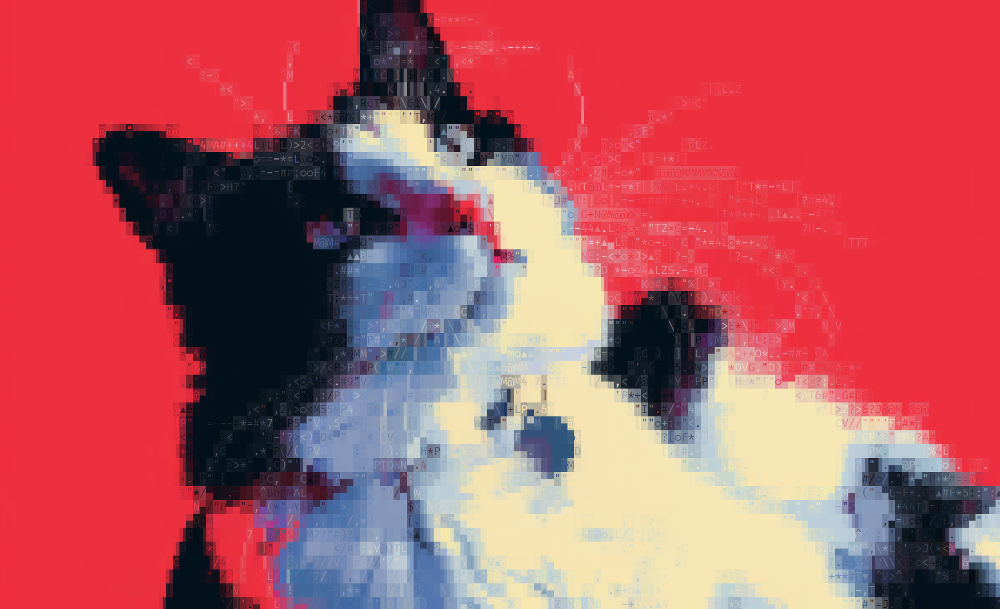

# ANSI Paintbrush

A Go fork of the [C++ ANSI Art rendering library](https://github.com/mafik/ansi-art) originally created by [Marek Rogalski](https://github.com/mafik).

ANSI Paintbrush allows you to convert images into colorful ASCII art using ANSI escape codes. It provides a simple interface for loading images, rendering them as ASCII art, and outputting the result in various formats.

## Example



## Features

- Convert images to ASCII art with ANSI color codes
- Load custom TTF fonts for character selection
- Adjustable output width
- Multi-threaded rendering for improved performance
- Multiple output formats (raw string, C-style string, Bash command)
- Weighting and adding specific characters
- Ability to exclude specific characters entirely

## Installation

```
go get github.com/jordanella/go-ansi-paintbrush
```

## Basic Usage

```
package main

import (
    "fmt"
    "image"
    "os"
    "time"

    "github.com/jordanella/go-ansi-paintbrush"
)

func main() {
    // Create a new AnsiArt instance
    aa := paintbrush.New()

    // Load a TTF font
    fontData, _ := os.ReadFile("path/to/your/font.ttf")
    aa.LoadTTF(fontData)

    // Load an image
    file, _ := os.Open("path/to/your/image.png")
    img, _, _ := image.Decode(file)
    aa.LoadImage(img)

    // Set the desired width of the output
    aa.SetWidth(150)

    // Start the rendering process (with 10 threads)
    aa.StartRender(10)

    // Wait for rendering to complete
    for aa.GetRenderProgress() < 1.0 {
        fmt.Printf("Rendering progress: %.2f%%\r", aa.GetRenderProgress()*100)
        time.Sleep(100 * time.Millisecond)
    }

    // Print the result
    fmt.Printf("\r%s", aa.GetResultRaw())
}
```

## Planned Features

- Configurable height constraint
- Advanced sizing options (stretch, bottleneck, crop, etc.)
- Command-line argument handling
- Render image to file

## Interface Reference

```
type AnsiArtInterface interface {
    LoadTTF(data []byte) error
    LoadImage(img image.Image)
    Render()
    StartRender(nThreads int)
    GetRenderProgress() float32
    GetResultRaw() string
    GetResultC() string
    GetResultBash() string
    GetResultRGBABytes() []byte
    GetResultRGBADimensions() (width, height int)
    SetWidth(int)
    AddForbiddenCharacter(string)
    RemoveForbiddenCharacter(string)
    ClearForbiddenCharacters()
    GetForbiddenCharacters() []string
    IsForbiddenCharacter(string) bool
	SetAspectRatio(float64)
	GetAspectRatio() float64
	SetGlyphDimensions(width, height int)
	GetGlyphDimensions() (width, height int)
	SetRuneLimits(start, end int)
	GetRuneLimits() (start, end int)
}
```

## Contributing

Contributions are welcome! Please feel free to submit a Pull Request.

## License

This project is licensed under the [MIT License](LICENSE).

## Acknowledgements

This project is a Go port of the original [C++ ANSI Art library](https://github.com/mafik/ansi-art) created by Marek Rogalski. I am very grateful for their work, which served as the foundation for this Go implementation.
